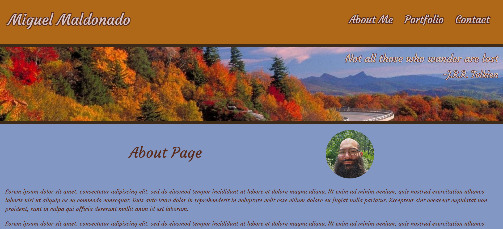

# Portfolio made with React
<!-- Title  -->

<!-- Title  -->

## Description
Here's a collection of various projects I've created, representing what I consider to be the best showcase of my progress throughout this course.

---

## Table of Contents

<!-- Table of Contents -->

- [About The Project](#about_project)
- [Built With](#built_with)
- [Features](#features)
- [Deployment Location](#deployment_location)
- [License](#license)
- [Final Note](#final_note)

---

## About The Project 
<!-- About the Project -->
This project demonstrates my skill with React. Creating a single-page application and also give a space to show my portfolio of projects. 

---

### Built With 
<!-- Built With -->
React, JSON, JavaScript, CSS, Vite.

---

### Features 
<!-- Features -->

* About page describing my history.
* Profile page showing past projects.
* A contact page that has a means of writing a email message to me. 

---

## Deployment Location 

<!-- Deployment Location -->
Live site: https://miguel-m-portfolio.netlify.app/

Github: https://github.com/TrueMiguel/20-Portfolio-with-React

<!-- screen shot example of project -->

---

## License 
MIT License

    Copyright (c) 2023 Miguel Maldonado
    
    Permission is hereby granted, free of charge, to any person obtaining a copy
    of this software and associated documentation files (the "Software"), to deal
    in the Software without restriction, including without limitation the rights
    to use, copy, modify, merge, publish, distribute, sublicense, and/or sell
    copies of the Software, and to permit persons to whom the Software is
    furnished to do so, subject to the following conditions:
    
    The above copyright notice and this permission notice shall be included in all
    copies or substantial portions of the Software.
    
    THE SOFTWARE IS PROVIDED "AS IS", WITHOUT WARRANTY OF ANY KIND, EXPRESS OR
    IMPLIED, INCLUDING BUT NOT LIMITED TO THE WARRANTIES OF MERCHANTABILITY,
    FITNESS FOR A PARTICULAR PURPOSE AND NONINFRINGEMENT. IN NO EVENT SHALL THE
    AUTHORS OR COPYRIGHT HOLDERS BE LIABLE FOR ANY CLAIM, DAMAGES OR OTHER
    LIABILITY, WHETHER IN AN ACTION OF CONTRACT, TORT OR OTHERWISE, ARISING FROM,
    OUT OF OR IN CONNECTION WITH THE SOFTWARE OR THE USE OR OTHER DEALINGS IN THE
    SOFTWARE.

---

## Final Note 
<!-- Final Note -->
This is showing my skill with React and several of my past projects. 

---
    
